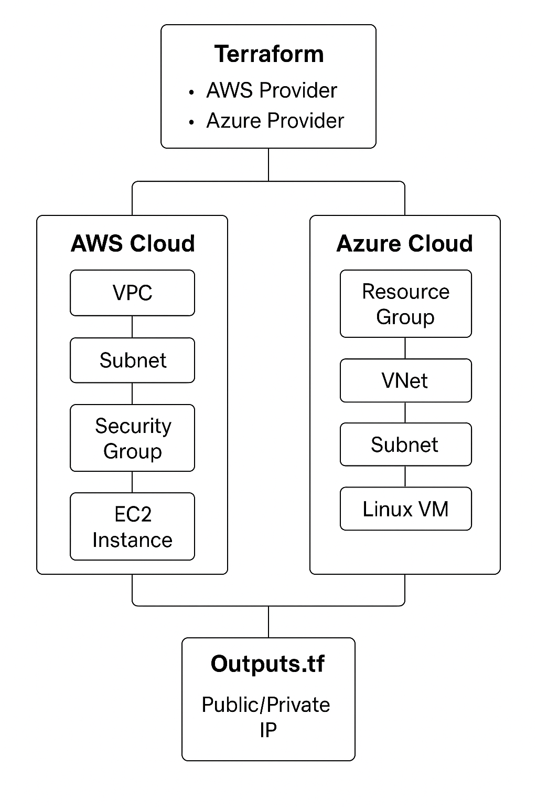

#  MultiCloud Infrastructure Deployment 

## 🧭 Project Overview
To provision and connect infrastructure across AWS and Azure using Terraform  showing how a single Infrastructure-as-Code (IaC) tool can manage resources on multiple clouds simultaneously.
The goal is to showcase **multi-cloud infrastructure as code (IaC)** provisioning and managing resources across two cloud platforms consistently.

---

## Architecture

## How It Works

Flow:

1. Terraform initializes and connects to both AWS and Azure providers.

2. It creates:

    AWS: VPC, Subnet, Security Group, and EC2 instance.

    Azure: Resource Group, Virtual Network, Subnet, Network Interface, and Linux VM.

3. Once deployed:
 
    The AWS EC2 instance gets a Public IP.

     The Azure VM gets a Private IP.

4. Outputs are displayed automatically after Terraform apply.   

### 🔒 DevSecOps Integration: tfsec
 Security enforcement is embedded directly into the Terraform workflow using tfsec + pre-commit hooks ensuring vulnerabilities and misconfigurations are caught before deployment.
 ### What This Proves in Real-World DevOps:
 1. Automatic Terraform security scanning
 2. Prevents insecure code from being committed
 3. Compliance becomes built-in, not an afterthought
 4. Stronger security posture for multi-cloud deployment

### What This Proves 
| Capability | Why It Matters |
|-----------|----------------|
| Single IaC workflow for multiple clouds | Streamlined operations & automation |
| Standardized resource creation | No need to master every cloud tool |
| Consistent security + networking | Reduced misconfigurations |
| Unified lifecycle commands | Faster provisioning & cleanup |
| Hybrid cloud demonstration | Strong DevOps use case |

###  AWS Components

* VPC – Creates a secure network environment for the EC2 instance.

* Subnet – Allocates network space inside the VPC.

* Security Group – Controls inbound/outbound traffic (e.g., SSH access).

* EC2 Instance – A Linux-based VM with a public IP.

###  Azure Components

* Resource Group – Logical container for Azure resources.

* Virtual Network (VNet) – Main network for Azure VM.

* Subnet – Network segment within VNet.

* Network Interface – Connects the VM to the network.

* Linux Virtual Machine – Ubuntu-based VM with private IP.
